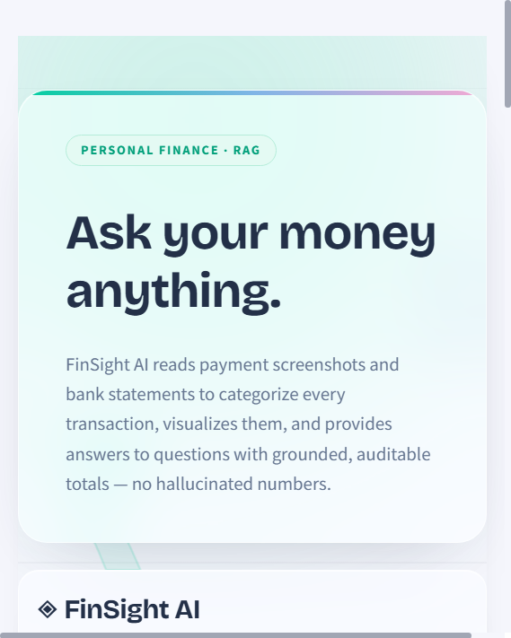
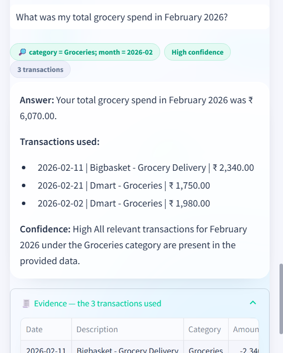
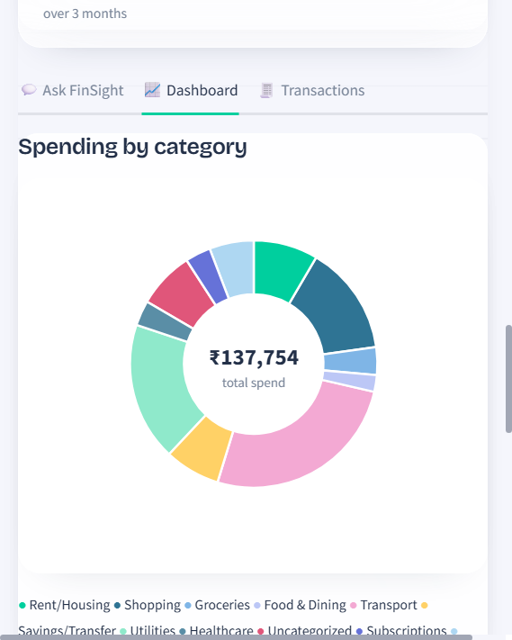

<div align="center">

# ◈ FinSight AI

**Ask your money anything — get grounded, auditable answers in ₹.**

FinSight AI reads **payment screenshots** and **bank statements** (CSV / PDF), categorizes
every transaction, visualizes your spending, and answers natural-language money questions
by showing the exact transactions it used — so every number is verifiable and nothing is
hallucinated.


</div>

<p align="center">
  
</p>

---

## ✨ Highlights

- **📸 Screenshot → ledger in one drop.** Share a UPI / bank payment screenshot and Gemini
  vision reads the amount, payee UPI ID, transaction reference and UTR, then files it into
  the same schema as your statement. Duplicate UTRs are deduped automatically.
- **🔒 Grounded answers, never guessed.** Retrieval does the finding; the LLM only phrases
  what it is explicitly given. A strict system prompt forces totals in ₹, shows the rows
  used, and says *“I cannot determine”* when the data is insufficient.
- **🎯 Exact aggregates — the classic RAG bug, fixed.** Aggregate questions retrieve the
  **complete** matching set via metadata filters (category / month / merchant), not a
  top-K sample that silently drops transactions and corrupts the total.
- **🧾 Auditable evidence.** Every answer carries its retrieval scope, a confidence badge,
  and an expandable evidence table of the exact transactions behind the number.
- **🖥️ Local & offline-first.** Embeddings (`all-MiniLM-L6-v2`) and ChromaDB run 100%
  locally; a deterministic engine answers correctly with **no API key at all**.
- **📄 Tolerant ingestion.** Column-name variants, mixed date formats, `(50.00)` negatives,
  `₹`/`$` symbols, split debit/credit columns — from CSV **or** PDF tables.
- **🎨 A dashboard worth showing.** Money-themed backdrop with frosted-glass panels,
  KPI cards, category donut, monthly trends and a full transaction ledger.
- **🧪 Provable correctness.** An offline evaluation harness scores retrieval recall,
  precision and total accuracy against ground truth — no LLM call required.

<p align="center">
  
  &nbsp;&nbsp;
  
</p>

<p align="center"><sub>
Left: a grounded answer — retrieval scope, confidence, and the exact rows used.&nbsp;
Right: spending by category over the loaded statement.
</sub></p>

---

## 🧩 The problem

Bank statements are long, messy and impossible to query. *“How much did I spend on
groceries in February?”* means scrolling, filtering and summing by hand — and most LLM
chatbots asked this will **hallucinate** a plausible-but-wrong number.

## 🛠️ The fix

FinSight never lets the model guess. Every answer is computed from transactions that
retrieval actually found, and the receipt of that retrieval is shown to the user.

```
  payment.png ──────► GEMINI VISION ────┐  amount · payee UPI ID · txn ref · UTR · date
                                        ▼
                              shared transaction schema   ◄── dedup by UTR
                                        ▲
  statement.csv / .pdf ──► PARSERS ─────┘  tolerant dates, ₹/$, debit/credit columns
                                        ▼
                              CATEGORIZATION — ordered rule engine, 12 categories,
                              unmatched rows flagged "Uncategorized" (never buried)
                                        ▼
                              EMBEDDINGS — all-MiniLM-L6-v2 (local, free)
                              one rich chunk per transaction → ChromaDB (persisted)
                                        ▼
  "total grocery      QUERY PARSER — question → intent, category, month, merchant
   spend in Feb?" ──►                 → metadata filter
                                        ▼
                              RETRIEVAL — filtered and COMPLETE (not top-K)
                                        ▼
                              GENERATION — Gemini (or deterministic offline engine)
                              grounded in ₹, shows its working, or says
                              "I cannot determine"
```

---

## 🔎 Retrieval accuracy (verified offline)

`python scripts/run_evaluation.py` scores retrieved sets against the CSV ground truth.
Every golden case returns the **complete** matching set (recall 1.00):

| Question | Filter applied | Txns | Total | |
|---|---|---:|---:|:--:|
| Total spent at Swiggy | merchant = swiggy | 2 | ₹910 | ✅ |
| Grocery spend in Feb 2026 | category + month | 3 | ₹6,070 | ✅ |
| Subscriptions across all months | category | 14 | ₹4,519 | ✅ |
| Total income (Jan–Mar) | category + months | 4 | ₹2,04,500 | ✅ |
| Transport spending in January | category + month | 3 | ₹3,200 | ✅ |

> The subscriptions case returns **14** rows — a naive top-K = 10 retriever would have
> dropped 4 and produced a wrong total.

---

## 📁 Project structure

```
FinSight-AI/
├── finsight/
│   ├── config.py                      # paths, models, categories, constants
│   ├── ingestion/
│   │   ├── csv_extractor.py           # messy CSV → clean DataFrame
│   │   ├── pdf_extractor.py           # bank PDF tables → same clean schema
│   │   └── screenshot_extractor.py    # Gemini vision → shared transaction schema
│   ├── categorization/categorizer.py  # ordered rule engine
│   ├── embeddings/vector_store.py     # chunking, ChromaDB build/query, filters
│   ├── rag/
│   │   ├── query_parser.py            # question → structured retrieval plan
│   │   ├── qa_pipeline.py             # retrieve → prompt → grounded answer
│   │   └── local_answer.py            # deterministic offline answer (no LLM)
│   ├── synthetic_statement.py         # seeded generator for realistic ledgers
│   └── evaluation/                    # golden dataset, metrics, eval runner
├── app/
│   └── app.py                         # Streamlit UI: ask / dashboard / transactions
├── scripts/
│   ├── ingest.py                      # CLI: CSV → clean CSV/Parquet + summary
│   ├── generate_statement.py          # CLI: reproducible synthetic statement
│   └── run_evaluation.py              # CLI: offline retrieval eval (+ --llm)
├── tests/                             # pytest suite (unit + integration)
├── docs/images/                       # UI screenshots used in this README
├── data/
│   ├── raw/bank_statement.csv         # sample statement shipped with the repo
│   └── samples/upi_payment.png        # synthetic UPI receipt for the vision demo
├── .github/workflows/ci.yml           # ruff + pytest + eval on push
├── pyproject.toml
└── requirements.txt
```

---

## 🚀 Getting started

```bash
# 1. Clone and enter the project
git clone https://github.com/ShivamSolves/FinSight-AI.git && cd FinSight-AI

# 2. Create a virtual environment
python -m venv .venv
source .venv/Scripts/activate        # Windows Git Bash
# source .venv/bin/activate          # macOS / Linux

# 3. Install (editable, so `finsight` is importable everywhere)
pip install -e ".[dev]"              # or: pip install -e .   (runtime only)

# 4. (Optional — better answer phrasing + screenshot reading) add a Gemini key
cp .env.example .env                 # then paste GEMINI_API_KEY=... (free tier works)

# 5. Launch
streamlit run app/app.py
```

> **No key? No problem.** Ingestion, categorization, retrieval, the dashboard and the
> evaluation harness all run fully offline. The key only unlocks LLM phrasing and
> screenshot vision.

---

## 💬 Usage

**The web app** — upload a statement (or click *Load sample statement*), optionally drop in
payment screenshots, then ask questions in plain language:

```
What was my total grocery spend in February 2026?
How much did I spend at Swiggy?
Show all my subscriptions across all months
```

**Ingest a statement from the CLI:**

```bash
python scripts/ingest.py --input data/raw/bank_statement.csv
```

**Generate a reproducible synthetic statement** (real bank data is never public, so the
generator produces seeded ledgers — same seed ⇒ same CSV — at any size):

```bash
python scripts/generate_statement.py --months 12 --seed 42
```

**Evaluate retrieval (offline, no key):**

```bash
python scripts/run_evaluation.py          # retrieval recall / precision / totals
python scripts/run_evaluation.py --llm    # + score real LLM answers (needs key)
```

**Use it as a library:**

```python
from finsight.ingestion.csv_extractor import load_csv
from finsight.categorization.categorizer import categorize_dataframe
from finsight.rag.qa_pipeline import build_and_ask

df = categorize_dataframe(load_csv("data/raw/bank_statement.csv"))
result = build_and_ask(df, "What was my total grocery spend in February 2026?")

print(result.answer)   # grounded answer with the transactions it used
print(result.scope)    # the metadata filter that was applied
```

---

## 🧪 Testing

```bash
ruff check .                    # lint
pytest -m "not integration"     # fast offline unit suite (106 tests)
pytest                          # + retrieval integration (builds the store)
python scripts/run_evaluation.py  # end-to-end retrieval correctness report
```

CI runs lint + tests + the offline evaluation on every push.

---

## ☁️ Deployment

FinSight deploys to **Streamlit Community Cloud** for a free public URL:

1. Push this repo to GitHub.
2. At [share.streamlit.io](https://share.streamlit.io) → **New app** → repository,
   branch `main`, **Main file path `app/app.py`**.
3. In **Advanced settings → Secrets**, add `GEMINI_API_KEY = "..."` (TOML). The repo's
   `.env` is gitignored, so this is the only place the key lives in production.
4. Deploy → you get a shareable `https://<app>.streamlit.app` link.

> `sentence-transformers` pulls PyTorch; on Linux add a CPU-only index to
> `requirements.txt` (`--extra-index-url https://download.pytorch.org/whl/cpu`) to keep
> the free-tier build small and fast.

---

## 🗺️ Roadmap

- [x] CSV ingestion, categorization, local embeddings, grounded RAG
- [x] Metadata-filtered retrieval for exact aggregates
- [x] Evaluation harness (retrieval recall / precision + total accuracy)
- [x] pytest suite + GitHub Actions CI
- [x] Streamlit UI — ask / dashboard / transactions
- [x] PDF bank-statement ingestion (`pdfplumber`)
- [x] Payment-screenshot ingestion via Gemini vision (amount, UPI ID, UTR)
- [x] Money-themed frosted-glass dashboard redesign
- [ ] Public deployment (Streamlit Community Cloud)
- [ ] Real-statement dataset analysis (Kaggle, MIT-licensed)
- [ ] Fully offline vision fallback (local OCR)

---

## 🧰 Tech stack

`pandas` · `sentence-transformers` · `ChromaDB` · `google-genai` (Gemini — text + vision) ·
`Streamlit` + `Altair` (UI) · `pdfplumber` · `python-dotenv` · `pytest` ·
`scikit-learn` (eval) · `GitHub Actions` (CI)

---

## 📄 License

MIT — free to use, modify and redistribute.

---

<div align="center">

**Built to prove a point:** an LLM finance assistant is only as trustworthy as the
retrieval underneath it.

</div>
